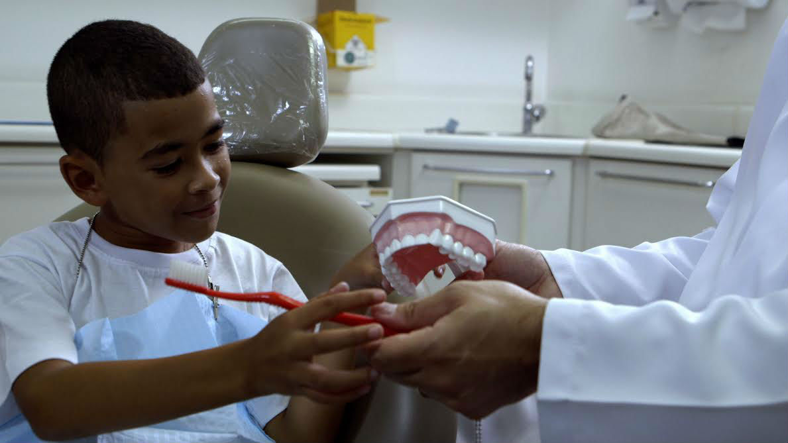
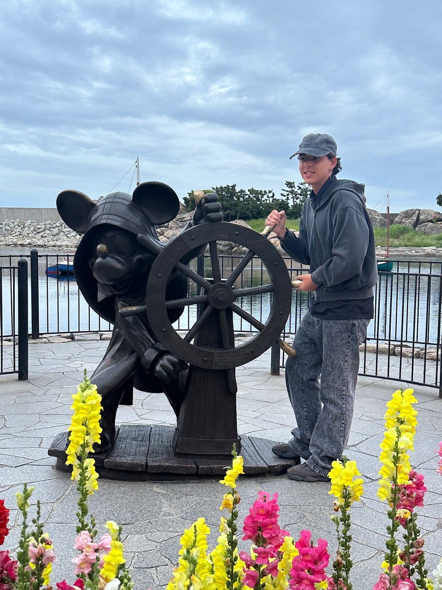

# 🦷 Nuvem do Bem — CRM Social

> Plataforma digital desenvolvida para centralizar e organizar as informações da ONG **Turma do Bem**, reunindo dentistas voluntários, beneficiários e patrocinadores em um único sistema. O objetivo é transformar a gestão social em um processo simples, moderno e colaborativo.

---

## Tecnologias Utilizadas

| Tecnologia | Versão | Descrição |
|---|---|---|
| [React](https://react.dev/) | 19 | Biblioteca para construção de interfaces |
| [TypeScript](https://www.typescriptlang.org/) | 6 | Tipagem estática para JavaScript |
| [Vite](https://vite.dev/) | 8 | Bundler e servidor de desenvolvimento |
| [Tailwind CSS](https://tailwindcss.com/) | v4 | Estilização utilitária via classes |
| [React Router DOM](https://reactrouter.com/) | v7 | Roteamento entre páginas |
| [React Hook Form](https://react-hook-form.com/) | v7 | Gerenciamento e validação de formulários |
| [Recharts](https://recharts.org/) | v3 | Gráficos e visualizações de dados |
| [Font Awesome](https://fontawesome.com/) | 6 | Ícones vetoriais via CDN |

---

## Estrutura de Pastas do Projeto

```
NuvemDoBem-React/
├── public/
├── src/
│   ├── assets/                          # Imagens e fotos do projeto
│   │   ├── Imagem_Principal.jpg
│   │   ├── Sobre1.webp
│   │   ├── Sobre2.jpg
│   │   ├── turmadobem.jpg
│   │   ├── Matheus.png
│   │   ├── Davi.jpg
│   │   └── Pedro.jpg
│   │
│   ├── Components/
│   │   ├── layout/                      # Componentes globais de layout
│   │   │   ├── Header.tsx               # Cabeçalho e menu público
│   │   │   ├── AppHeader.tsx            # Cabeçalho da área autenticada
│   │   │   └── Footer.tsx               # Rodapé
│   │   ├── sections/                    # Seções reutilizáveis de página
│   │   │   ├── HeroSection.tsx          # Hero com imagem e chamada para ação
│   │   │   ├── BenefitsSection.tsx      # Grade de cards de benefícios
│   │   │   └── FaqSection.tsx           # Acordeão de perguntas frequentes
│   │   ├── ui/                          # Componentes de interface atômicos
│   │   │   ├── Button.tsx
│   │   │   ├── Card.tsx
│   │   │   ├── Input.tsx
│   │   │   └── SectionTitle.tsx
│   │   └── PrivateRoute.tsx             # Proteção de rotas autenticadas
│   │
│   ├── context/
│   │   └── AuthContext.tsx              # Contexto global de autenticação (JWT)
│   │
│   ├── data/
│   │   └── integrantes.ts               # Dados dos membros da equipe
│   │
│   ├── hooks/
│   │   └── usePageTitle.ts              # Hook para atualizar o título da aba
│   │
│   ├── pages/                           # Uma pasta por rota da aplicação
│   │   │
│   │   ├── — Área Pública —
│   │   ├── HomePage/                    # Página inicial
│   │   ├── SobrePage/                   # Sobre o projeto
│   │   ├── OngPage/                     # Sobre a Turma do Bem
│   │   ├── FaqPage/                     # Perguntas frequentes
│   │   ├── IntegrantesListPage/         # Lista de integrantes do time
│   │   ├── IntegranteDetailPage/        # Perfil individual de integrante
│   │   ├── ContatoPage/                 # Formulário de contato
│   │   ├── LoginPage/                   # Login (email + senha)
│   │   └── CadastroPage/               # Cadastro (Dentista / Beneficiário / Patrocinador / Funcionário)
│   │
│   │   ├── — Área do Funcionário (Integrante) —
│   │   ├── DashboardPage/               # Painel com abas Dentistas / Beneficiários / Patrocinadores
│   │   │   └── tabs/
│   │   │       ├── DentistasTab.tsx
│   │   │       ├── BeneficiariosTab.tsx
│   │   │       └── PatrocinadoresTab.tsx
│   │   ├── CasosPage/                   # Gerenciamento de casos clínicos
│   │   ├── ProntuarioPage/              # Prontuário dos beneficiários
│   │   ├── RelatoriosPage/              # Relatórios e estatísticas
│   │   ├── IntegracoesPage/             # Integrações com APIs externas
│   │   └── ChatPage/                    # Chat interno entre funcionários
│   │
│   │   ├── — Área do Dentista —
│   │   └── DentistaAreaPage/            # Dashboard do dentista: pedidos, casos e diagnósticos
│   │
│   │   ├── — Área do Beneficiário —
│   │   └── BeneficiarioAreaPage/        # Área do beneficiário: casos e status
│   │
│   │   ├── — Área do Patrocinador —
│   │   └── PatrocinadorAreaPage/        # Área do patrocinador: doações e histórico
│   │
│   │   └── PerfilPage/                  # Perfil do usuário logado (compartilhado)
│   │
│   ├── services/                        # Camada de comunicação com a API REST
│   │   ├── api.ts                       # apiFetch centralizado com autenticação JWT
│   │   ├── dentistaService.ts
│   │   ├── beneficiarioService.ts
│   │   ├── patrocinadorService.ts
│   │   ├── casoService.ts
│   │   ├── diagnosticoService.ts
│   │   ├── doacaoService.ts
│   │   ├── pedidoEncaminhamentoService.ts
│   │   ├── historicoStatusService.ts
│   │   └── enderecoService.ts
│   │
│   ├── types/
│   │   └── index.ts                     # Interfaces TypeScript (Dentista, Caso, Doacao, etc.)
│   │
│   ├── utils/
│   │   └── masks.ts                     # Máscaras de CPF, CNPJ e telefone
│   │
│   ├── App.tsx                          # Roteamento principal (público + privado)
│   ├── main.tsx                         # Ponto de entrada da aplicação
│   └── index.css                        # Estilos globais e configuração do Tailwind
│
├── index.html
├── package.json
├── tsconfig.json
├── vercel.json                          # Configuração de deploy (SPA rewrite)
└── vite.config.ts
```

---

## Imagens e Ícones do Projeto

### Capturas de Tela

| Tela | Descrição |
|---|---|
|  | Página inicial com hero e chamada para ação |

### Ícones — Font Awesome 6

O projeto utiliza a biblioteca **Font Awesome 6** (via CDN) para todos os ícones da interface:

| Ícone | Classe FA | Onde é usado |
|---|---|---|
| Dente | `fa-solid fa-tooth` | Aba Dentistas, banner dentista |
| Mão com coração | `fa-solid fa-hand-holding-heart` | Patrocinadores, doações |
| Usuário | `fa-solid fa-user` | Aba Beneficiários, perfil |
| Médico | `fa-solid fa-user-doctor` | Banner área do dentista |
| Pasta | `fa-solid fa-folder-open` | Casos clínicos |
| Estetoscópio | `fa-solid fa-stethoscope` | Diagnósticos |
| Caixa | `fa-solid fa-box` | Doações em equipamentos |
| Dinheiro | `fa-solid fa-money-bill-wave` | Doações monetárias |
| Sino | `fa-solid fa-bell` | Notificações / pedidos pendentes |
| Check círculo | `fa-solid fa-circle-check` | Confirmação de ações |
| Exclamação | `fa-solid fa-circle-exclamation` | Mensagens de erro |
| Casa | `fa-solid fa-house` | Navegação — Início |
| Crachá | `fa-solid fa-id-badge` | Tipo de cadastro Funcionário |
| GitHub | `fa-brands fa-github` | Link para perfil GitHub |
| LinkedIn | `fa-brands fa-linkedin` | Link para perfil LinkedIn |

---

## Autores e Créditos

<table>
  <tr>
    <td align="center">
      <br/>
      <strong>Matheus Peres</strong><br/>
      RM: 567300 · Turma: 1TDSPR<br/>
      Desenvolvedor Front-end<br/><br/>
      <a href="https://github.com/MaThPMJ">
        
      </a>
      <a href="https://www.linkedin.com/in/matheus10122002/">
        
      </a>
    </td>
    <td align="center">
      <br/>
      <strong>Davi Isac</strong><br/>
      RM: 567265 · Turma: 1TDSPR<br/>
      Desenvolvedor Front-end<br/><br/>
      <a href="https://github.com/klaanyz">
        
      </a>
      <a href="https://www.linkedin.com/in/davi-isac-a1a774372/">
        
      </a>
    </td>
    <td align="center">
      <br/>
      <strong>Pedro Gonçalves</strong><br/>
      RM: 567651 · Turma: 1TDSPR<br/>
      Desenvolvedor Front-end<br/><br/>
      <a href="https://github.com/PxdroGoncalves">
        
      </a>
      <a href="https://www.linkedin.com/in/pedro-gonçalves-23561b389">
        
      </a>
    </td>
  </tr>
</table>

---

## Como Usar

### Pré-requisitos

- [Node.js](https://nodejs.org/) versão 18 ou superior
- npm (incluso com o Node.js)

### Instalação e execução local

```bash
# 1. Clone o repositório
git clone https://github.com/MaThPMJ/NuvemDoBem-React

# 2. Acesse a pasta do projeto
cd NuvemDoBem-React

# 3. Instale as dependências
npm install

# 4. Inicie o servidor de desenvolvimento
npm run dev
```

Acesse `http://localhost:5173` no navegador.

### Build para produção

```bash
npm run build
```

Os arquivos gerados ficam na pasta `dist/`.

### Contas de teste

| Tipo | E-mail | Senha |
|---|---|---|
| Funcionário | sandra.costa@funcionario.com | 123456 |
| Dentista | ana.costa@dentista.com | 123456 |
| Beneficiário | joao.silva@beneficiario.com | 123456 |

### Links

| | |
|---|---|
| **Repositório GitHub** | [github.com/MaThPMJ/NuvemDoBem-React](https://github.com/MaThPMJ/NuvemDoBem-React) |
| **Vídeo no YouTube** | [youtu.be/AFPI6A1FeYQ](https://www.youtube.com/watch?v=fEgc4Rw-NvM&t=4s) |
| **Deploy (Vercel)** | [nuvem-do-bem.vercel.app](nuvem-do-bem-react.vercel.app) |

---

## Contato

| Integrante | Contato |
|---|---|
| **Matheus Peres** | [LinkedIn](https://www.linkedin.com/in/matheus10122002/) · [GitHub](https://github.com/MaThPMJ) |
| **Davi Isac** | [LinkedIn](https://www.linkedin.com/in/davi-isac-a1a774372/) · [GitHub](https://github.com/klaanyz) |
| **Pedro Gonçalves** | [LinkedIn](https://www.linkedin.com/in/pedro-gonçalves-23561b389) · [GitHub](https://github.com/PxdroGoncalves) |

---

> Projeto acadêmico desenvolvido na **FIAP** — Sprint 4 · Turma 1TDSPR
